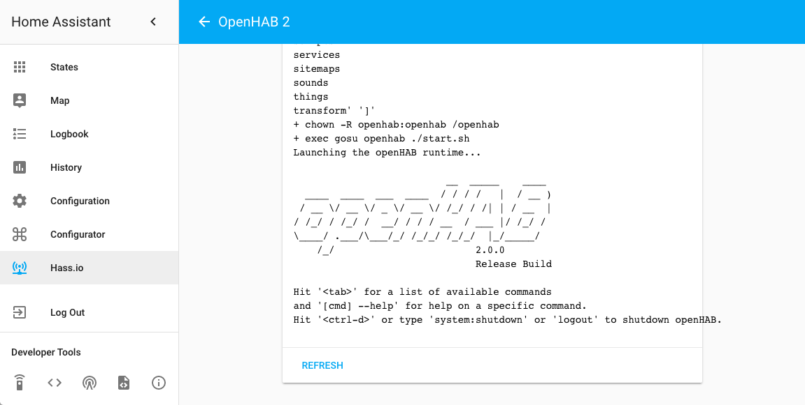
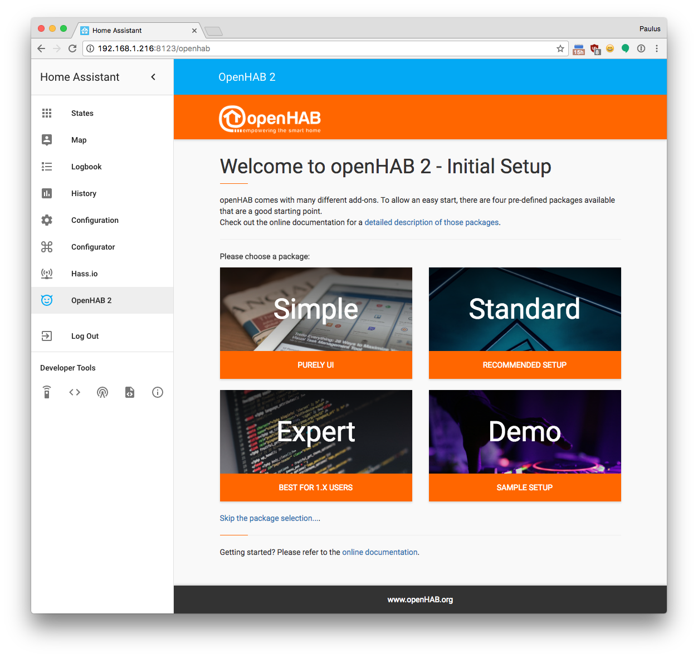

OpenHAB 2
---------

Building this locally takes 10 minutes on my Raspberry Pi 3. So when clicking install in the UI, it will timeout. Don't worry, after 10 minutes it will popup as installed and you can start it.

 - Based off https://github.com/openhab/openhab-docker/tree/master/2.0.0/armhf
 - Added `ENV VERSION %%VERSION%%` to satisfy Hass.io
 - Created a config.json that exposes port 8080 (on which OpenHAB exposes their HTTP server)
 - After installing add-on, add as an iframe panel to make UI part of Home Assistant:

 ```yaml
iframe_panel:
  openhab:
    title: 'OpenHAB 2'
    url: 'http://hassio.local:8080/'
    icon: mdi:emoticon-devil
 ```




